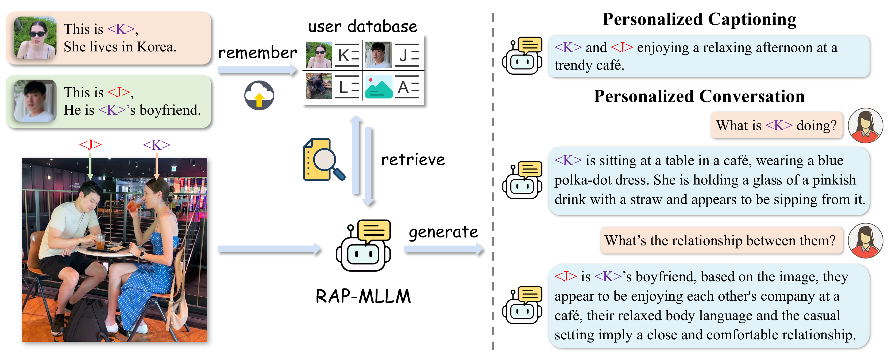

## RAP: Retrieval-Augmented Personalization for Multimodal Large Language Models

### [Paper](https://arxiv.org/abs/2410.13360) | [Project Page](https://hoar012.github.io/RAP-Project/) | [Model](https://huggingface.co/Hoar012/RAP-LLaVA-13b) | [Data](https://github.com/Hoar012/Rap-MLLM/blob/main/data/Data.md)

## News
- **2025.3.16** The RAP dataset is now available. Access it [here](https://github.com/Hoar012/Rap-MLLM/blob/main/data/Data.md).🔥🔥
- **2025.2.27** RAP is accepted by CVPR 2025!🎉🎉
- **2024.11.24** Release code and model weights.

## Personalize Your Multimodal Large Language Model via Retrieval Augmented Generation.

|  |
|:--:|
| Introduce some user-specific concepts to our RAP-MLLM, it can remember them and achieve excellent performance in a variety of personalized multimodal generation tasks. |


Visit our [Project Page](https://hoar012.github.io/RAP-Project/) for more demostrations.

## 📋 Contents

- [Install](#install)
- [Models](#models)
- [Demo](#demo)
- [Data](#data)
- [Training](#Training)
- [Evaluation](#evaluation)

<!-- Note: This repository is still under construction. -->


### Install

1. Clone the repo into a local folder.

```bash
git clone https://github.com/Hoar012/RAP-MLLM.git

cd RAP-MLLM
```

2. Install packages.

```bash
conda create -n rap python=3.10 -y
conda activate rap
pip install --upgrade pip  # enable PEP 660 support
pip install -e .
pip install -e ".[train]"
pip install flash-attn --no-build-isolation

pip install -r requirements.txt
```

### Models
Pretrained model weights are available on Hugging Face.

RAP-LLaVA: [RAP-LLaVA-13b](https://huggingface.co/Hoar012/RAP-LLaVA-13b); RAP-Phi3-V: [RAP-Phi3-mini](https://huggingface.co/Hoar012/RAP-Phi3-mini)

### Demo

**Build Your Personal Database:**

Each concept record in the database can be structured with the following format:
```
{
    "concept_dict": {
        "<concept>": {
            "name": "concept_name",
            "image": "image_path",
            "info": "",
            "category": ""
        }
    },
    "path_to_concept": {
        "image_path": "<concept>",
    }
}
```
We provide an example of the database in `example_database`.

**CLI Demo:**
```bash
python cli.py --model-path Hoar012/RAP-LLaVA-13b --image-file /path/to/test_image --retrieval --database example_database --topK 1
```

### Data
Please check [Data](https://github.com/Hoar012/Rap-MLLM/blob/main/data/Data.md) for more detail.

### Training
We provide the training scripts with DeepSpeed below. Try training on your own dataset!

| Model | RAP-LLaVA | RAP-Phi3-V | LLaVA-LoRA |
| --- | --- | --- | --- |
| Script | [script](https://github.com/Hoar012/RAP-MLLM/blob/main/scripts/train_rap_llava.sh) | [script](https://github.com/Hoar012/RAP-MLLM/blob/main/scripts/train_rap_phi3.sh) | [script](https://github.com/Hoar012/RAP-MLLM/blob/main/scripts/train_lora_llava.sh) |

### Evaluation

#### Prepare Data
Please download the test data used in the paper from the repositories of [MyVLM](https://github.com/snap-research/MyVLM) and [Yo'LLaVA](https://github.com/WisconsinAIVision/YoLLaVA).

#### Evaluation on Image Captioning
```bash
python eval/caption.py  --eval-file /path/to/eval_file --model-path Hoar012/RAP-LLaVA-13b --retrieval --database /path/to/database --topK 2
```

The `eval-file` records the image paths to be evaluated and their corresponding target concepts, formatted as follows:
```
{
    "/path/to/image": [
        "target_concept"
    ],
}
```

#### Evaluation on Question Answering
```bash
python eval/VQA.py --eval-file eval/yollava-visual-qa.json --model-path Hoar012/RAP-LLaVA-13b --retrieval --database /path/to/database --topK 1
```

#### Evaluation on Visual Recognition
```bash
python eval/recognition.py --eval-file eval/recognition_test.json --model-path Hoar012/RAP-LLaVA-13b --retrieval --database /path/to/database --topK 1
```


## BibTeX

```
@InProceedings{Hao_2025_CVPR,
    author    = {Hao, Haoran and Han, Jiaming and Li, Changsheng and Li, Yu-Feng and Yue, Xiangyu},
    title     = {RAP: Retrieval-Augmented Personalization for Multimodal Large Language Models},
    booktitle = {Proceedings of the Computer Vision and Pattern Recognition Conference (CVPR)},
    month     = {June},
    year      = {2025},
    pages     = {14538-14548}
}
```

## Acknowledgement
[LLaVA](https://github.com/haotian-liu/LLaVA), [MyVLM](https://github.com/snap-research/MyVLM), [YoLLaVA](https://github.com/WisconsinAIVision/YoLLaVA)