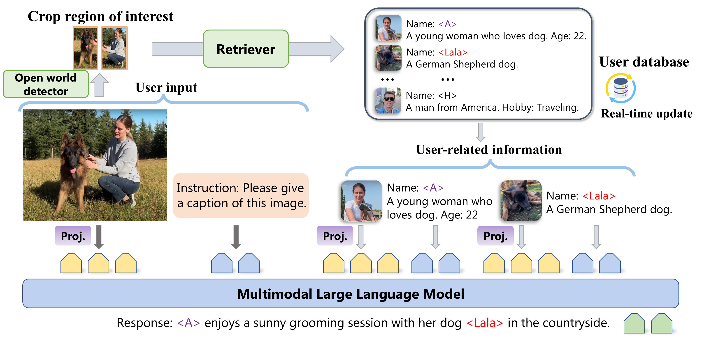

# RAP-MLLM: Retrieval Augmented Personalization for Multimodal Large Language Model

### [Paper](https://arxiv.org/abs/2410.13360) | [Project Page](https://hoar012.github.io/RAP-Project/) | [Model (Coming soon)](https://github.com/Hoar012/Rap-MLLM) | [Data (Coming soon)](https://github.com/Hoar012/Rap-MLLM)
The Chinese University of Hong Kong & Nanjing University

## News
- **2024.11.24** Release code.
- **2024.10.17** Release paper.

## Personalize Your Multimodal Large Language Model via Retrieval Augmented Generation.



<details><summary>More demostrations</summary>


</details>


## BibTeX

```
@misc{hao2024rememberretrievegenerateunderstanding,
        title={Remember, Retrieve and Generate: Understanding Infinite Visual Concepts as Your Personalized Assistant}, 
        author={Haoran Hao and Jiaming Han and Changsheng Li and Yu-Feng Li and Xiangyu Yue},
        year={2024},
        eprint={2410.13360},
        archivePrefix={arXiv},
        primaryClass={cs.CV},
        url={https://arxiv.org/abs/2410.13360}, 
  }
```